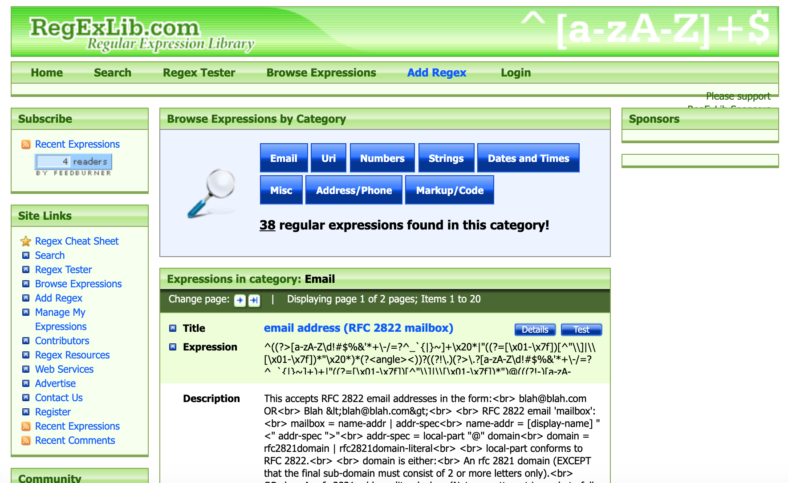
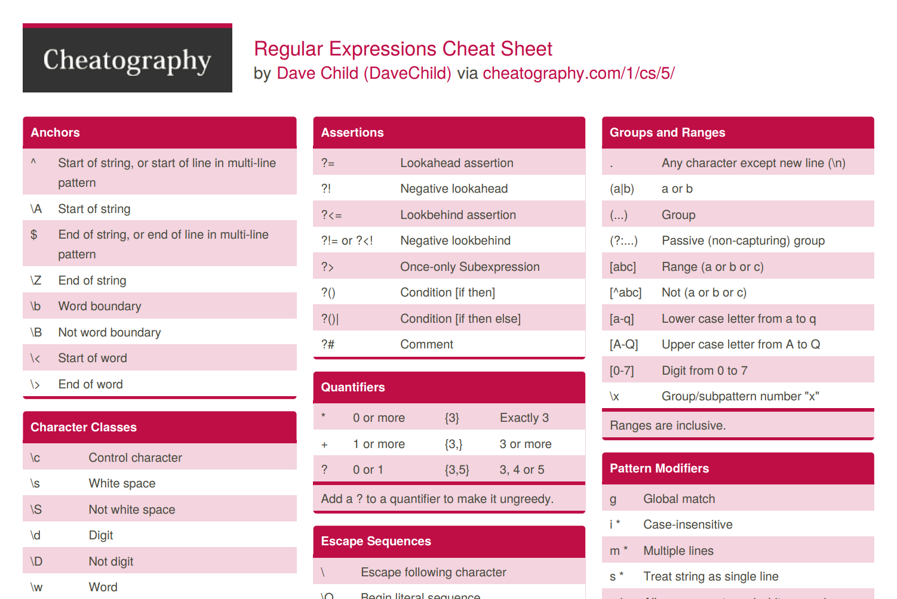
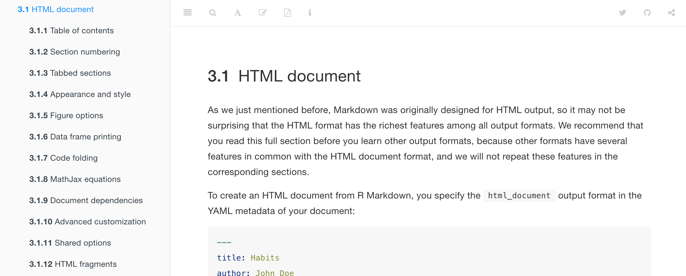
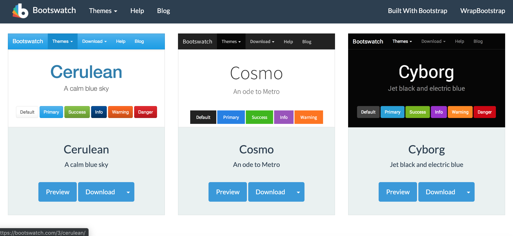

```{r setup, include=FALSE}
knitr::opts_chunk$set(echo = TRUE)
```
# Comparativa de páginas 
A continuación se exponen las páginas más útiles (en mi opinión) para expresiones regulares y Markdown. De cada una se discuten pros y contras basados en la facilidad tanto para navegar por las mismas, como para su comprensión y  su aplicación al proyecto.

## Expresiones regulares{.tabset}

Las páginas escogidas para esta comparación son [regexlib.com](http://regexlib.com/?AspxAutoDetectCookieSupport=1) y [cheatography.com](https://www.cheatography.com/davechild/cheat-sheets/regular-expressions/pdf/) :

### regexlib.com
Se trata de una página con un extensísimo catálogo, el cual incluye multitud de ejemplos, un tester para las expresiones y también un cheatsheet. Su utilidad radica sobre todo en su **buscador por categorías**, que te lleva directamente al ejemplo que necesitas (validación de email, fechas,  números de teléfono, etc.). También se puede buscar usando keywords y ordenar los resultados basados en el rating de los usuarios, lo cual le da un punto más de fiabilidad. En su contra cabe decir que el diseño de la página no es muy vistoso, lo cual dificulta la navegación al principio.



### cheatography.com
Se trata de un **cheatsheet en pdf** hecho por <span style="color:skyblue">Dave Child</span>. Tiene un diseño más atractivo a la vista que el cheatsheet de la anterior página y además, tiene un contenido más extenso. Encuentro más útil este estilo de página a la hora de buscar comandos siendo principiante, por su diseño en forma de tablas y su sencillez que facilitan un acceso rápido a la información requerida. En su contra, para un usuario con cierta experiencia se va a quedar corto muy rápido.


    
## Markdown{.tabset}

Para esta comparación (y para la realización del proyecto) se han utilizado las páginas [bookdown.org](https://bookdown.org/yihui/rmarkdown/html-document.html) y [bootswatch.com/](https://bootswatch.com/3/):

### bookdown.org
En esta página aparecen todas las características y comandos utilizados para crear un documento HTML. Aporta ejemplos del código utilizado en cada caso, por lo que es útil para principiantes también. Además, incluye links a diversos cheatsheets que sirven para cada paso del proceso. En este proyecto ha resultado útil para la creación de la **Tabla de Contenidos** y la inclusión de **pestañas** e **imágenes** en los distintos apartados, entre otros.



### bootswatch.com/
Esta página resulta muy útil para elegir los **temas** que mejor se ajuste al proyecto. Incluye una explicación detallada de cada tema y de la apariencia de las diferentes partes: las tablas, pestañas, botones especiales... En su contra cabe decir que es muy específico en una sola parte de todo el proyecto, así que sin otra página que complemente el contenido no serviría para realizar un trabajo entero.



# Lectura de los datos
```{r echo=FALSE, warning = FALSE, message = FALSE}
library(knitr)
library(dplyr)
datos <- read.table("recursos/FPL_2018_19_Wk0.csv", sep = ",", header = TRUE)
```

## Introducción


Para este proyecto se ha utilizado un dataset sobre el juego Fantasy de la Premier League para la temporada 2018/2019. Los juegos fantasy consisten en, partiendo de un presupuesto limitado, montar un equipo que consiga el mayor número de puntos posibles. 

En este dataset, aparecen las estadísticas de la temporada 2017/2018, así que nuestro objetivo será encontrar, basándonos en esos datos, el mejor equipo posible (el que más puntos pueda dar) para la temporada 2018/2019. Los fichajes realizados en el verano de 2018 y los jugadores de los equipos recién ascendidos aparecen en el dataset, pero todas sus estadísticas tienen valor 0.

Para contabilizar los puntos, se tienen en cuenta los datos de goles anotados y asistencias, mientras que las tarjetas amarillas y rojas o los goles en propia portería cuentan negativo. En el caso de los porteros y defensas, se utiliza el número de goles concedidos por el equipo (con ellos sobre el campo) para restar puntos, mientras que para los porteros, las paradas realizadas suman puntos. De tal forma, el rendimiento individual puede compensar un pobre rendimiento colectivo.

Otros datos importantes serán: el precio del jugador en el juego, el equipo en el que juegan, minutos jugados, el TSB (porcentaje de equipos en los que aparece el jugador en cuestión) y el ICT, un medidor de valores de influencia en el juego del equipo, amenaza de cara a gol y creatividad .

Es importante remarcar que una parte de las puntuaciones también dependen de la opinión de la prensa, así que no considero este juego una ciencia exacta y objetiva. De ahí que algunas conclusiones están condicionadas por la falta de datos de estas opiniones.

## Lectura

A continuación, en clave general, un ejemplo de las primeras filas en forma de tabla:

```{r echo=FALSE, warning = FALSE, message = FALSE}
datos_limpio <- select(datos, Name, Team, Position, Cost, ICT, Goals_scored, Goals_conceded, Assists, Own_goals, Saves, Yellow_cards, Red_cards, TSB, Minutes, Bonus, Points)
kable(head(datos_limpio))

```

Primero, vamos a ver si el valor ICT tiene una relación directa con los puntos obtenidos:

```{r echo=FALSE, warning = FALSE, message = FALSE}
datos_ICT <- select(datos_limpio, Name, Team, Position, ICT, Points)
datos_ICT_ord<- datos_ICT[order(-datos_ICT$ICT),]
kable(datos_ICT_ord[1:20,])
```

Vemos que el ICT sí está relacionado con los puntos obtenidos, pero hay jugadores que con un ICT alto no han conseguido muchos puntos. Esto es probable que tenga que ver con los minutos jugados, ya que un buen jugador que no juega no aporta puntos (obviamente). La lesiones o un traspaso a mitad de temporada pueden ser los causantes de estas anomalías (caso de Cesc Fábregas, por ejemplo). También destaca que los jugadores con mejor ICT son en su mayoría mediocampistas.

Ahora se expone el top 20 de porteros en función de las paradas realizadas:

```{r echo=FALSE, warning = FALSE, message = FALSE}
datos_porteros <- datos_limpio[datos_limpio$Position == "GKP",]
datos_porteros <- select(datos_porteros, Name, Team, Cost, Minutes, Saves, Goals_conceded, Points)
datos_porteros_ord <- datos_porteros[order(-datos_porteros$Saves),]
kable(datos_porteros_ord[1:20,])

```

Cabe destacar que, pese a su influencia, el portero con más puntos NO ES el que más paradas hizo, sino que los goles concedidos tienen igual o más importancia.

Y también, aquí vemos la tabla de máximos goleadores de la temporada 2017/2018:

```{r echo=FALSE, warning = FALSE, message = FALSE}
tabla_goleadores <- datos_limpio[order(-datos_limpio$Goals_scored),]
tabla_goleadores <- select(tabla_goleadores, Name, Team, Cost, Minutes, Goals_scored, Assists, Points)
kable(tabla_goleadores[1:10,])
```

En este caso, la correlación puntos/goles es más lineal. Sólo un caso extraordinario (**Sterling** dio 17 asistencias con 18 goles anotados) sobrepasa con creces a otros jugadores con varios goles más.

Por último, vamos a ver qué jugadores fueron los más elegidos por los usuarios a la hora de confeccionar su equipo:

```{r echo=FALSE, warning = FALSE, message = FALSE}
datos_tsb <- datos_limpio[order(-datos_limpio$TSB),]
datos_tsb <- select(datos_tsb, Name, Team, Cost, TSB, Points)
kable(datos_tsb[1:20,])
```

Vemos que, en general, el usuario elige con buen criterio a sus jugadores. Hay casos que destacan, como el de **Aubameyang**. Este jugador estaba en el 25% de los equipos pero aparece un dato de puntos muy bajo. Esto se debe a que llegó a la Premier League en Enero, así que su elección está justificada.


# Gráficos{.tabset}

Para esta sección vamos a relacionar diversas variables que nos pueden ayudar a prever el rendimiento de los jugadores y así conformar el equipo más competitivo posible. 

## Por equipos

Primero, ¿de qué equipo debo elegir jugadores si quiero más puntos?

```{r echo=FALSE, warning = FALSE, message = FALSE}
library(ggplot2)
library(reshape2)
library(plotly)
library(dplyr)

ggplot(datos_limpio, aes(x = Cost, y = Points, colour = Position)) +  
  geom_point() + 
  facet_wrap(~ Team) 
```

De aquí sacamos la conclusión de que, para nuestros jugadores ofensivos, deberíamos ir a por el máximo número de jugadores posible del tradicional TOP 6 (Manchester City, Liverpool, Chelsea, Manchester United, Tottenham y Arsenal) ya que aseguran más puntos. Encontrar el equilibrio presupuestario entre estos jugadores y los  de los equipos más pequeños es donde radica la dificultad del juego.

## Porteros

```{r echo=FALSE, warning = FALSE, message = FALSE}
plot_ly(data = datos_porteros, x = ~Cost, y = ~Points, color = ~Name, type = "scatter", mode = "markers", size = 30) %>%
layout(title = 'Porteros', 
         xaxis = list(title = 'Precio'),
         yaxis = list(title = "Puntos"))
```

Podemos observar que el portero con más puntos es también el más caro (Ederson, del Manchester City). Sin embargo, de cara a optimizar nuestros recursos, las opciones más recomendables son casualmente (o no) los porteros que aparecían en cabeza de la clasificación previamente vista de más paradas realizadas: <span style="color:yellow">**Fabianski, del West Ham**</span> y <span style="color:yellow">**Ryan, del Brighton & Hove Albion**</span>, ambos de equipos más humildes que, al recibir más tiros, tienen más opciones de "lucirse".

## Defensas
Para encontrar a los mejores defensas, vamos primero a contrastar si el equipo menos goleado tiene los defensas con más puntos

```{r echo=FALSE, warning = FALSE, message = FALSE}
datos_defensas <- datos_limpio[datos_limpio$Position == "DEF",]

ggplot(datos_defensas, aes(x = Goals_conceded, y = Points , colour = Cost)) +  
  geom_point() + 
  facet_wrap(~ Team)
```

Vemos que en general sí, los dos equipos menos goleados (los dos de Manchester) tienen los defensas más caros porque son los que más puntos tienen. También que los equipos pequeños tienen defensas con buena relación *puntos/precio* pese a ser más goleados. Habrá que buscar el equilibrio.

Por su posición y función, los defensas son los jugadores más sancionados con tarjetas. Vamos a ver como afectan las tarjetas amarillas a los puntos a final de temporada.

```{r echo=FALSE, warning = FALSE, message = FALSE}
plot_ly(data = datos_defensas, x = ~Yellow_cards, y = ~Points, color = ~Name, type = "scatter", mode = "markers", size = 30) %>%
layout(title = 'Amonestaciones', 
         xaxis = list(title = 'Tarjetas amarillas'),
         yaxis = list(title = "Puntos"))
```

Destaca que el defensa mejor puntuado sea uno de los menos amonestados. Es <span style="color:yellow">**César Azpilicueta, jugador del Chelsea**</span>, que solo fue amonestado una vez en toda la temporada. Además, el segundo defensa mejor puntuado es casualmente otro español del Chelsea: span style="color:yellow">**Marcos Alonso**</span>.

Para terminar con los defensas, veamos si esos defensas de equipos más pequeños son buenos en relación *calidad/precio*, y también si <span style="color:yellow">**César Azpilicueta**</span> es una opción rentable.

```{r echo=FALSE, warning = FALSE, message = FALSE}
ggplot(datos_defensas, aes(x = Cost, y = Points, colour = Team)) +  
  geom_point() 
```

Esta distribución llama la atención a primera vista, ya que parece claro que **la calidad de los defensas se paga**. 

## Mediocampistas

Para elegir los mejores mediocampistas, nos fijaremos en el ICT, que como vimos antes es un campo donde destacan por encima del resto de posiciones.

```{r echo=FALSE, warning = FALSE, message = FALSE}
datos_medios <- datos_limpio[datos_limpio$Position == "MID",]
ggplot(datos_medios, aes(x = Points, y = ICT , colour = Cost)) +  
  geom_point() + 
  facet_wrap(~ Team)

```

Aquí se ve que los mejores equipos tienen los jugadores con más ICT (salvo un par de excepciones) y también, los más caros. Veamos ahora la relación entre su contribución al marcador (goles y asistencias) y su ICT:

```{r echo=FALSE, warning = FALSE, message = FALSE}
plot_ly(data = datos_medios, x = ~Goals_scored, y = ~Assists, color = ~Name, type = "scatter", mode = "markers", size = 30) %>%
layout(title = 'Influencia en el marcador', 
         xaxis = list(title = 'Goles'),
         yaxis = list(title = "Asistencias"))

```

Vemos una vez más que <span style="color:yellow">**Mohammed Salah, del Liverpool**</span> fue el mejor jugador de la temporada, y cualquier equipo que lo fiche tendrá previsiblemente muchos puntos asegurados. <span style="color:yellow">**Sterling y Kevin De Bruyne, del Manchester City**</span> también se antojan como muy buenos jugadores franquicia.

Para acabar el análisis de los mediocampistas, veamos su relación *puntos/precio*:

```{r echo=FALSE, warning = FALSE, message = FALSE}
ggplot(datos_medios, aes(x = Points, y = Cost, colour = Team)) +  
  geom_point() 
```

Una vez más, una relación muy lineal. Como la opción más rentable, destaca el <span style="color:yellow">**mediocampista del Brighton & Hove Albion, Pascal Groß**</span>.

## Delanteros

Para elegir a nuestros delanteros, vamos a tener en cuenta que no se pueden fichar dos que valgan mucho y no tener dinero para el resto del equipo. Por tanto, vamos a relacionar primero los *goles/precio* y también *goles/minutos jugados*.

```{r echo=FALSE, warning = FALSE, message = FALSE}
ggplot(datos_limpio, aes(x = Cost, y = Goals_scored, colour = Team)) +  
  geom_point() 

ggplot(datos_limpio, aes(x = Minutes, y = Goals_scored, colour = Team)) +  
  geom_point()

```

Teniendo en cuenta las dos gráficas, destaca sobre todo el caso de <span style="color:yellow">**Jamie Vardy, jugador del Leicester**</span>, ya que es el más rentable en relación *goles/precio* y además fue el que más minutos jugó de los máximos goleadores. El caso de <span style="color:yellow">**Kun Agüero, delantero del Manchester City**</span> también es destacable, pero no por ello recomendable, ya que pese a tener el mejor ratio *goles/minutos*, lo es porque jugó 1000 minutos menos que sus competidores, siendo además su precio uno de los más altos de todo el juego. Gastar tantos recursos en un jugador que se pierde tantos partidos puede salir muy bien si no se lesiona, pero ciertamente es arriesgado.